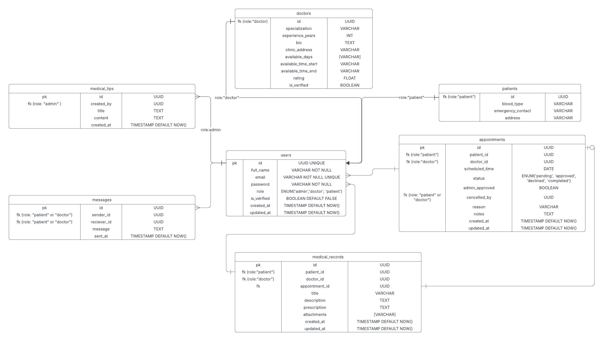

# Medichoice AI

Medichoice AI is an intelligent healthcare assistant designed to help users make informed medical decisions. Leveraging advanced AI algorithms, it provides personalized recommendations, symptom analysis, and reliable health information to support both patients and healthcare professionals.

## 🗃️ Database Schema for MediChoice AI

The **MediChoice AI** application utilizes a well-structured relational database to manage patients, doctors, appointments, health records, and more.



---

### 🧱 Tables Overview

#### 1. `users`

```sql
id UUID PRIMARY KEY,
name VARCHAR,
email VARCHAR UNIQUE,
password_hash TEXT,
role ENUM('patient', 'doctor', 'admin'),
created_at TIMESTAMP,
updated_at TIMESTAMP
```

#### 2. `doctors`

```sql
id UUID PRIMARY KEY,
user_id UUID REFERENCES users(id),
specialization VARCHAR,
bio TEXT,
availability_schedule JSON
```

#### 3. `patients`

```sql
id UUID PRIMARY KEY,
user_id UUID REFERENCES users(id),
date_of_birth DATE,
gender VARCHAR,
blood_type VARCHAR
```

#### 4. `appointments`

```sql
id UUID PRIMARY KEY,
doctor_id UUID REFERENCES doctors(id),
patient_id UUID REFERENCES patients(id),
appointment_time TIMESTAMP,
status ENUM('scheduled', 'completed', 'cancelled'),
notes TEXT
```

#### 5. `medical_records`

```sql
id UUID PRIMARY KEY,
patient_id UUID REFERENCES patients(id),
doctor_id UUID REFERENCES doctors(id),
visit_date TIMESTAMP,
diagnosis TEXT,
prescriptions JSON,
attachments TEXT -- file URL or path
```

#### 6. `messages`

```sql
id UUID PRIMARY KEY,
sender_id UUID REFERENCES users(id),
receiver_id UUID REFERENCES users(id),
content TEXT,
timestamp TIMESTAMP
```

---

### 📝 Notes

- All timestamps default to `NOW()` on creation.
- Proper indexing is applied on foreign keys and searchable fields.
- Sensitive data (e.g., password hashes) is securely stored using encryption and hashing mechanisms.
