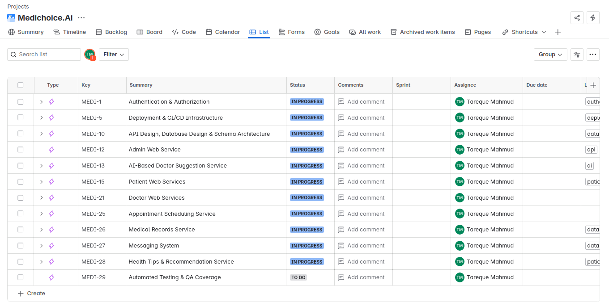
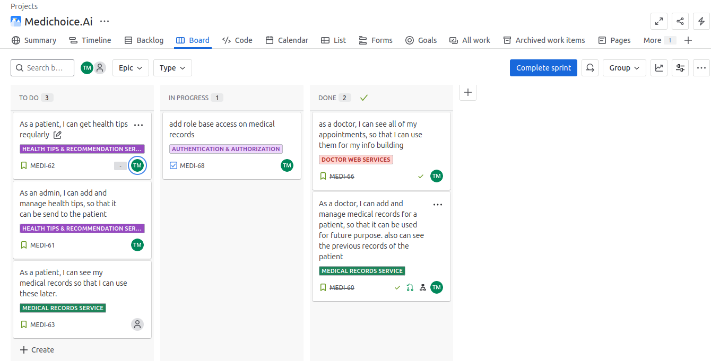
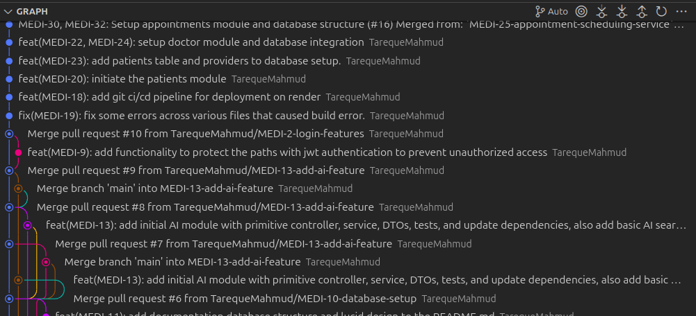
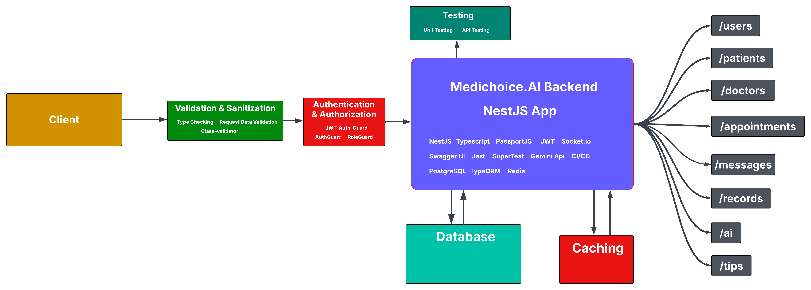

# Medichoice AI

Medichoice AI is an intelligent healthcare assistant designed to help users make informed medical decisions. Leveraging advanced AI algorithms, it provides personalized recommendations, symptom analysis, and reliable health information to support both patients and healthcare professionals.

## JIRA Planning Screenshot

Below is a JIRA board screenshot showing the structured planning, sprint and epic mapping for MediChoice AI development:




The entire app project was thoroughly managed using JIRA under the Scrum methodology to ensure consistent velocity and organized sprints.

### GitHub Commit Graph

Below is a commit activity graph from GitHub, showing active development tied to JIRA stories (e.g., `MEDI-1`, `MEDI-2`, ...):



Commits were conventionally formatted to reflect the corresponding JIRA issue keys (e.g., `feat(MEDI-13): add initial AI module`), ensuring traceability between code and tasks.

## Backend Architecture - MediChoice AI

The **MediChoice AI** backend is developed using **NestJS**, a scalable and modular framework for building efficient server-side applications. The architecture ensures strong separation of concerns and follows industry best practices.

---

### Tech Stack

- **Framework**: NestJS (TypeScript)
- **Auth**: Passport.js, JWT
- **Validation**: Class-validator
- **Database**: PostgreSQL with TypeORM
- **Caching**: Redis
- **API Docs**: Swagger UI
- **AI Integration**: Gemini API
- **Real-Time Communication**: Socket.io
- **CI/CD**: GitHub Actions with Docker
- **Testing**: Jest, SuperTest (unit & e2e tests)

---

### Request Lifecycle

```mermaid
graph LR
    A[Client]
        --> B[Validation & Sanitization]
        --> C[Authentication & Authorization]
        --> D[Medichoice.AI Backend - NestJS App]
    D --> E[/users]
    D --> F[/patients]
    D --> G[/doctors]
    D --> H[/appointments]
    D --> I[/records]
    D --> J[/ai]
    D --> K[/tips]
    D --> L[/messages]
```

---

### Concept Map

The following diagram visualizes the MediChoice AI backend request flow and module interactions:



This diagram illustrates how clients interact with the NestJS backend through validation, authorization, services, and how various modules connect to endpoints, database, caching, and testing.

---

### Backend Folder Structure

Below is the structure of the NestJS backend in the `./backend` directory:

```plaintext
backend/
├── src/
│   ├── ai/
│   ├── appointments/
│   ├── auth/
│   ├── common/
│   │   ├── decorators/
│   │   ├── guards/
│   │   ├── types/
│   │   └── utils/
│   ├── database/
│   ├── doctors/
│   ├── messages/
│   ├── patients/
│   ├── records/
│   ├── tips/
│   ├── users/
│   ├── app.module.ts
│   └── main.ts
├── test/
├── Dockerfile
├── .env
├── package.json
├── tsconfig.json
└── nest-cli.json
```

Each module (e.g., `doctors`, `patients`, `auth`) follows the standard NestJS module structure with:

- `controller.ts`
- `service.ts`
- `dto/`
- `entities/`
- `test/`
- `providers.ts`

---

### Testing

- Unit Tests (Services, Guards)
- Integration Tests (Controllers)
- End-to-End Tests using `@nestjs/testing` and SuperTest

---

### Running the Backend Locally

To run the MediChoice AI backend application locally, follow these steps:

```bash
# Navigate to the backend directory
cd backend

# Install dependencies
npm install

# Run the development server with hot reload
yarn start:dev
# or
npm run start:dev

# Run unit tests
npm run test

# Run end-to-end tests
npm run test:e2e

# Run linter and fix formatting issues
npm run lint
```

Make sure you have a `.env` file configured properly with your database credentials and JWT secrets before running the application.

---

### Security & Guards

- **JWTAuthGuard** for token validation
- **RoleGuard** for access control
- **ValidationPipe** for input sanitization

This architecture enables robust, maintainable, and scalable service delivery while supporting AI-based recommendations and real-time features.

---

## Database Schema for MediChoice AI

The **MediChoice AI** application utilizes a well-structured relational database to manage patients, doctors, appointments, health records, and more.


---

### Tables Overview

#### 1. `users`

```sql
id UUID PRIMARY KEY,
name VARCHAR,
email VARCHAR UNIQUE,
password_hash TEXT,
role ENUM('patient', 'doctor', 'admin'),
created_at TIMESTAMP,
updated_at TIMESTAMP
```

#### 2. `doctors`

```sql
id UUID PRIMARY KEY,
user_id UUID REFERENCES users(id),
specialization VARCHAR,
bio TEXT,
availability_schedule JSON
```

#### 3. `patients`

```sql
id UUID PRIMARY KEY,
user_id UUID REFERENCES users(id),
date_of_birth DATE,
gender VARCHAR,
blood_type VARCHAR
```

#### 4. `appointments`

```sql
id UUID PRIMARY KEY,
doctor_id UUID REFERENCES doctors(id),
patient_id UUID REFERENCES patients(id),
appointment_time TIMESTAMP,
status ENUM('scheduled', 'completed', 'cancelled'),
notes TEXT
```

#### 5. `medical_records`

```sql
id UUID PRIMARY KEY,
patient_id UUID REFERENCES patients(id),
doctor_id UUID REFERENCES doctors(id),
visit_date TIMESTAMP,
diagnosis TEXT,
prescriptions JSON,
attachments TEXT -- file URL or path
```

#### 6. `messages`

```sql
id UUID PRIMARY KEY,
sender_id UUID REFERENCES users(id),
receiver_id UUID REFERENCES users(id),
content TEXT,
timestamp TIMESTAMP
```

---
